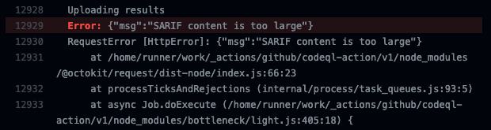

# Github SARIF Upload Troubeshooting

If you are having issues with your SARIF scan results not uploading correctly to your github repo using the code-scanning endpoints or the [upload-sarif action][1] you might find this useful.

## Common Issues

### Failure to Upload

If your CodeQL (or other scanner) file is too large you may get an error from the upload action that complains that the file is too large.

Githubs docs explain the restriction on file size [here][2].

> Notes:
> * SARIF upload supports a maximum of 5000 results per upload. Any results over this limit are ignored. If a tool generates too many results, you should update the configuration to focus on results for the most important rules or queries.
> * For each upload, SARIF upload supports a maximum size of 10 MB for the gzip-compressed SARIF file. Any uploads over this limit will be rejected. If your SARIF file is too large because it contains too many results, you should update the configuration to focus on results for the most important rules or queries.

### Upload is Successful but No Ouput

This could be due to a number of issues and is the result of the [upload-sarif action][1] not retreiving the status of the upload from the information endpoint: `/repos/{owner}/{repo}/code-scanning/sarifs/{sarif_id}`.

The program [`ghsarif.py`](ghsarif.py) should let you quickly test strategies for remediating this issue.

#### Command Overview

```
$ python3 ghsarif.py -h
usage: ghsarif [-h] owner repo {upload,check} ...

positional arguments:
  owner           Organization or user
  repo            Repo
  {upload,check}
    upload        Upload a SARIF file
    check         Check the status of a SARIF file

optional arguments:
  -h, --help      show this help message and exit
```

#### Upload Subcommand

This command will upload a SARIF file to the `/repos/{owner}/{repo}/code-scanning/sarifs` endpoint. It is useful to get specific information on file size and is required to provide the id that the `check` command needs.

```
$ python3 ghsarif.py owner repo upload -h
usage: ghsarif owner repo upload [-h] fname sha ref

positional arguments:
  fname       Filename of SARIF file to upload
  sha         Sha of commit
  ref         Ref of branch/pr

optional arguments:
  -h, --help  show this help message and exit
```

#### Check Subcommand

This command checks the upload status of a sarif file as defined by `id`. It provides detailed messages on the current status such as `processing` and `failed`.

```
$ python3 ghsarif.py owner repo check -h
usage: ghsarif owner repo check [-h] id

positional arguments:
  id          id of SARIF file given by the upload command

optional arguments:
  -h, --help  show this help message and exit
```

### Example Troubleshooting Workflow

1. `"SARIF content is too large"` error seen
    
   1. Run the scan on a local machine (see: [Getting started with the CodeQL CLI](https://codeql.github.com/docs/codeql-cli/getting-started-with-the-codeql-cli/))
   2. Run `gzip -c <scan>.sarif | base64 > <scan>.sarif.gz.b64` and check the size with `ls -lah <scan>.sarif.gz.b64`. 
   3. If the file size is [too big][2] you might have to shrink it first by reducing queries or only showing high severity issues.
2. After you have reduced the size if it is still not working you may have an issue with too many result paths.
   1. Either upload the file with `ghsarif <owner> <repo> upload <scan>.sarif <commit sha> <branch ref>` or get the id from the upload result in the GitHub action log.
   2. Check the status with `ghsarif <owner> <repo> check <id>`.
   3. If you see something refering to too many commit paths you can remove the optional `.runs[].results[].codeFlows` path from the sarif file with `cat <scan>.sarif | jq 'del(.runs[].results[].codeFlows)' > slimmed-<scan>.sarif`.
   
> Note:
>
> If you have found any other issues and found the solution please submit a PR

[1]: <https://github.com/github/codeql-action/tree/v1/upload-sarif> "Upload Sarif Action"
[2]: <https://docs.github.com/en/code-security/code-scanning/integrating-with-code-scanning/uploading-a-sarif-file-to-github#uploading-a-code-scanning-analysis-with-github-actions>